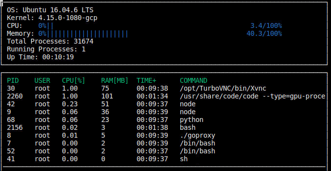

# CppND-System-Monitor

This repo contains the code for a System Monitor, which displays dynamic system and process information as seen in the snapshot below.

Only to be used for Linux operating systems.

## Dependencies
* ncurses
  * Linux: `sudo apt install libncurses5-dev libncursesw5-dev`
* cmake >= 3.11.3
  * All OSes: [click here for installation instructions](https://cmake.org/install/)
* make >= 4.1 (Linux, Mac), 3.81 (Windows)
  * Linux: make is installed by default on most Linux distros
* gcc/g++ >= 7.4.0
  * Linux: gcc / g++ is installed by default on most Linux distros

## Compiling and Running
To build the project: `make build` at /LinuxSystemMonitor

To run the resulting executable: `./build/monitor` at /LinuxSystemMonitor
